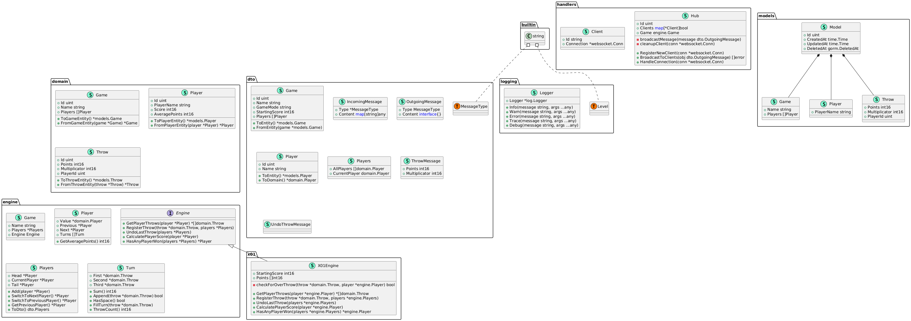

# triffgonix

[](https://sonarcloud.io/summary/new_code?id=DaniloMurer_triffgonix)


^ this logo is ai generated, but if you got a better one i'm open for suggestions : )

## what it is about

at work i had the task to mentor an intern into making a real-time dart application for our team.
while teaching him vue and quasar among other things, i wasn't really content with the way we went about the whole project.

therefore i wanted to give it my own spin, using go instead of pocketbase and nuxt instead of quasar for the frontend.
the real-time functionality will, at least so i think, be implemented using web sockets

## setup

install needed dependencies and yarn workspace setup:

```bash
# install node dependencies and sets up yarn workspaces as well as installing yarn package manager
yarn install

# installs go dependencies
yarn install:dependencies
```

### tools

this project is made with the **GONUTS** stack (yeah i know, really creative right?)

GO - well for golang in the backend.

NU - nuxt for the frontend, in the end this means vue.

TS - this can mean two things, typescript which is used in nuxt, but more importantly tailwindcss as the css and ui framework.

this means to run triffgonix you need a node environment and have go installed on your system.

### run project

run the `start` intellij run configuration or use following yarn command:

```bash
yarn start:dev
```

you can only start the frontend using the `start:client` intellij run configuration or following yarn command:
```bash
yarn start:client
```

you can only start the backend using the `start:server` intellij run configuration or following yarn command:
```bash
yarn start:server
```

### server tests

the backend has unit tests, crazy right? at the moment i mainly use unit tests to develop and assure functionality of the engine package.

you can run those tests using the `test:server` intellij run configuration or following yarn command:

```bash
yarn server:test
```

you can even get a testing coverage for the package using the `test:server` intellij run configuration with "run with coverage" or following yarn command instead:

```bash
yarn server:coverage
```

this will open the code coverage in your default browser.


## server code structure

for better comprehension and easier overview of the code, following [diagram](assets/diagram.puml) exists and is (hopefully) being updated regularly:


